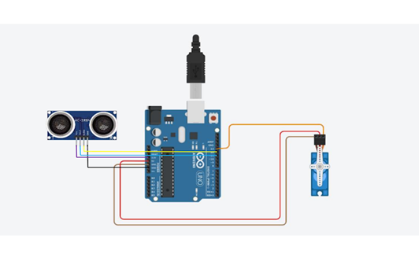
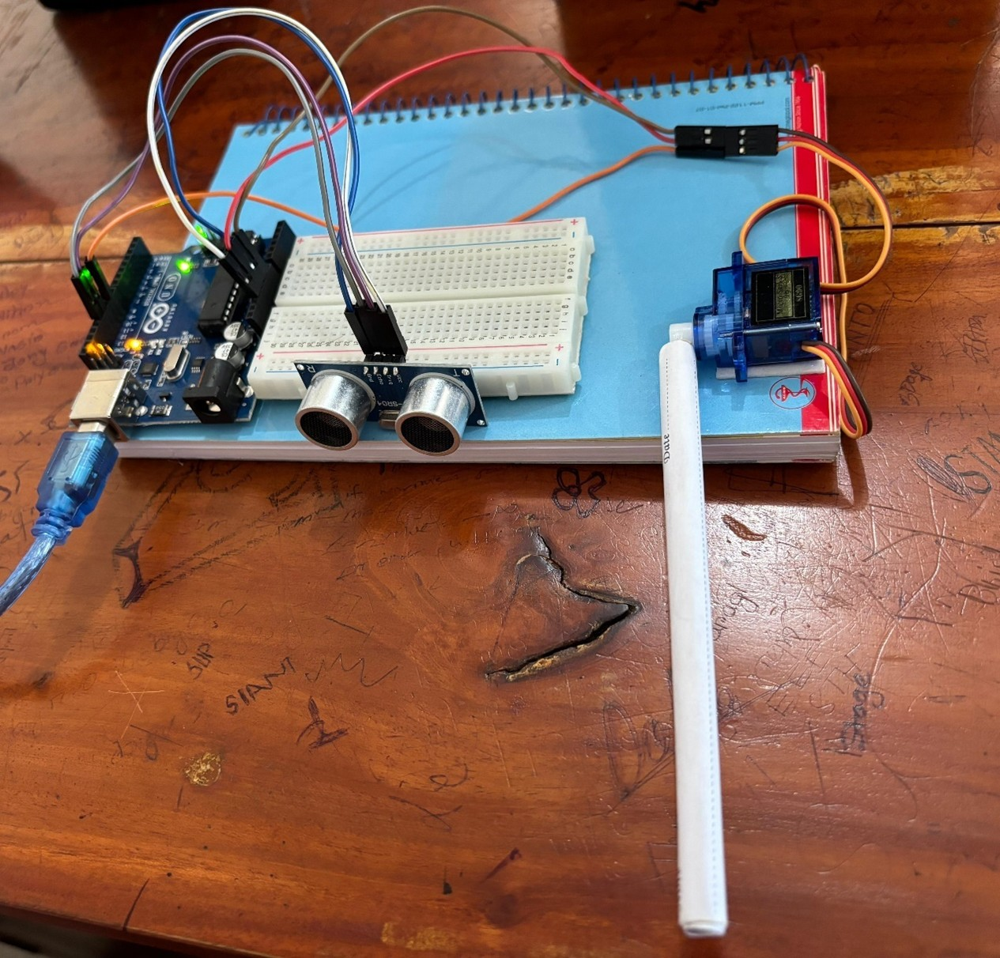

<!-- Logo -->
<p align="center">
  
</p>

<!-- Title Banner -->
<p align="center">
  
</p>

<h3 align="center">
  <b style="color:purple;">🚗 Arduino-Based Smart Parking Solution</b>
</h3>

<h3 align="center">
  <b>📊 Real-Time Parking Slot Detection Using Ultrasonic Sensors</b>
</h3>

<p align="center">
  
  
  
  
  
</p>


<!-- Overview Banner -->


**Digital Parking System Using Arduino** is an interactive project demonstrating **real-time parking slot detection** using **ultrasonic sensors and servo motors**.  

It detects whether a parking slot is occupied and displays the status via LEDs or an LCD screen, providing a **hands-on learning platform for sensor integration, actuator control, and embedded system programming**.

**Key Highlights:**
- Monitors multiple parking slots in real-time  
- Detects slot occupancy using ultrasonic sensors  
- Controls servo motors for automated actions (optional barrier control)  
- Displays parking availability on LEDs or LCD  
- Simple, modular Arduino-based hardware design  
- Ideal for learning, prototyping, or small-scale parking automation  

**Keywords:** Arduino parking system, ultrasonic sensor, servo motor, smart parking, real-time detection, embedded systems, automation


<!-- Objectives -->


- 🎯 Design and implement a basic digital parking system using Arduino  
- 🔄 Understand the operation of ultrasonic sensors for distance measurement  
- 📊 Create a system that detects available parking slots and displays the status  
- 🤖 Demonstrate actuator control using servo motors for automation  


<!-- Components & Cost -->


<div align="center">

| Component | Quantity | Approx. Cost (BDT) |
|-----------|---------|------------------|
| Arduino UNO | 1 | 760 |
| Ultrasonic Sensor (HC-SR04) | 2-4 | 200 |
| Servo Motor | 1 | 130 |
| LCD Display / LEDs | 1 | 150 |
| Jumper Wires | 10 | 25 |
| Breadboard | 1 | 50 |
| Power Supply / USB | 1 | 100 |
| **Total Cost** |  | **1,415+** |

</div>


<!-- Features -->


- 🚗 Real-time parking slot monitoring  
- 🔊 Distance detection using ultrasonic sensors  
- ⚙ Servo motor automation for barriers (optional)  
- 💡 LED/LCD display for slot availability  
- 🛠 Easy Arduino integration for prototyping  
- 📚 Educational and hobby-friendly project  


<!-- System Implementation -->


### 📷 Hardware Setup & Screens
The system integrates Arduino UNO, ultrasonic sensors, servo motors, and LEDs/LCD for real-time parking detection.

**Circuit Components:**
- Arduino UNO  
- Ultrasonic Sensors (HC-SR04)  
- Servo Motor (90°-180°)  
- LCD Display / LEDs  
- Jumper Wires & Breadboard  
- Power Supply  

**Circuit Diagram:**
<div align="center">

<p><b>Digital Parking System Circuit</b></p>
</div>

**Operation:**
- Ultrasonic sensors continuously measure the distance to detect cars in parking slots  
- LEDs or LCD indicate whether slots are available or occupied  
- Servo motor can operate a barrier or indicator based on slot occupancy  

<div align="center">
  
  <p><b>Digital Parking System in Action</b></p>
</div>


<!-- Project Structure -->


```bash
DigitalParkingSystem/
│── Arduino_Code/
│ ├── ParkingSystem.ino
│── Circuit_Diagram/
│ ├── circuit_diagram.png
│── Images/
│ ├── parking_demo.png
│ ├── parking_demo2.png
│── README.md
```

 


<!-- Setup & Usage --> 


Steps to Run:
```bash
1. Connect ultrasonic sensors to Arduino UNO as per the circuit diagram
2. Mount servo motor (if using barriers)
3. Connect LEDs or LCD for display
4. Upload ParkingSystem.ino to Arduino using Arduino IDE
5. Power Arduino via USB or external supply
6. Test slot detection by placing objects or cars in slots
7. Observe LED/LCD status and servo motor response
```

 

<!-- Future Work --> 


📡 Integrate multiple sensors for large parking lots  
🤖 Automated mobile app notification for available slots  
💬 Cloud-based monitoring and analytics   
🔋 Energy-efficient design with battery monitoring  

 

<!-- Conclusion --> 


Digital Parking System Using Arduino is a hands-on, deployable project demonstrating real-time parking detection and automation.

It serves as an educational platform, hobby project, or small-scale prototype for smart parking systems, while being modular and expandable for future enhancements.

 

<!-- Author --> 


### A. K. M. Masudur Rahman (Gaurab)

🎓 Department of Computer Science and Engineering (CSE)   
🏫 Bangladesh Army University of Science and Technology (BAUST), Saidpur   
📧 Email: akmmasudurrahmangaurab@gmail.com   

 

<!-- Support --> 
 

If you like this project, consider giving it a ⭐ on GitHub!
